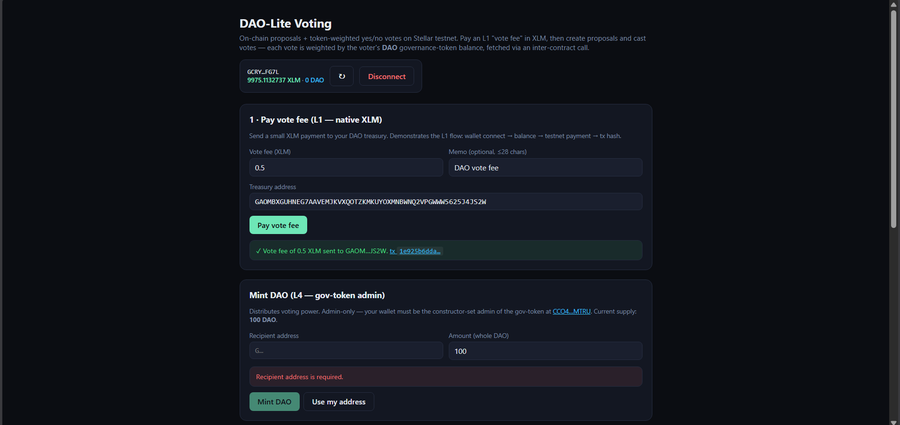

# DAO-Lite Voting

[](https://github.com/REPLACE_OWNER/REPLACE_REPO/actions/workflows/ci.yml)

A minimal on-chain DAO voting dApp on Stellar testnet — pay an L1 "vote fee" in XLM, then create proposals and cast **token-weighted** yes/no votes via two deployed Soroban contracts that talk to each other.

Built for the **Stellar Journey to Mastery: Monthly Builder Challenges** belt track. This README documents L1 + L2 + L3 + **L4** deliverables.

## Stack

- **Contracts:** Rust / `soroban-sdk = "25"`
  - `contracts/voting/` — proposals + weighted votes; sub-invokes the gov-token's `balance` from `cast_vote`
  - `contracts/gov-token/` — minimal SEP-41 governance token (custom token requirement)
- **Frontend:** React 19 + Vite + TypeScript — `frontend/`
- **Wallet:** [`@creit.tech/stellar-wallets-kit`](https://github.com/Creit-Tech/Stellar-Wallets-Kit) v2.x (Freighter, Albedo, xBull, Lobstr, …)
- **Network:** Stellar testnet (RPC `https://soroban-testnet.stellar.org`, Horizon `https://horizon-testnet.stellar.org`)
- **CI:** GitHub Actions — `cargo test --workspace --locked` + `npm test` + `npm run build` on every push/PR

## Repo layout

```
4.DAO-Lite-Voting/
├── Cargo.toml                       # workspace
├── Cargo.lock                       # committed for CI --locked
├── .github/workflows/ci.yml         # contracts + frontend CI
├── contracts/
│   ├── voting/                      # proposals + weighted votes
│   │   └── src/{lib.rs,test.rs}
│   └── gov-token/                   # SEP-41 governance token (L4 custom token)
│       └── src/{lib.rs,test.rs}
└── frontend/                        # Vite app
    ├── package.json
    ├── index.html
    ├── .env.example
    └── src/
        ├── config.ts                # network + contract ids + gov-token meta
        ├── lib.ts                   # pure helpers (xlm, weighted tally, error decoding)
        ├── lib.test.ts              # vitest unit tests for helpers
        ├── wallet.ts                # StellarWalletsKit wrapper
        ├── contract.ts              # Soroban + Horizon orchestration
        ├── App.tsx                  # UI (responsive, mobile-first)
        └── index.css
```

## Belt deliverables

### L1 · ⚪ White Belt — wallet + balance + first XLM tx

- **Wallet picker** via `@creit.tech/stellar-wallets-kit` — Freighter, Albedo, xBull, Lobstr all surface in `authModal()`.
- **Balance** is read from Horizon `loadAccount` and rendered in the wallet card; account-not-funded falls through to a "fund from friendbot" hint.
- **L1 vote-fee XLM payment** — the user enters a XLM amount + DAO treasury address, signs a native `payment` op, sees a success banner with a clickable `stellar.expert` tx link.
- **Transaction status** is rendered phase-by-phase: `preparing → signing → submitting → confirming` (also used by the L2/L4 contract calls).

### L2 · 🟡 Yellow Belt — contract + 3+ error types + status pipeline

- **Contract deployed** to testnet — see "Deployed addresses" below.
- **Contract called from the frontend** — `create_proposal(creator, title, description, voting_window_secs)` and `cast_vote(id, voter, support)`.
- **Three named error categories** required by the program are all handled by name:
  - **Wallet not found** → `'wallet-not-found'`. Triggered when the user has no supported wallet installed.
  - **Rejected** → `'rejected'`. Triggered when the user cancels the wallet's signature prompt.
  - **Insufficient balance** → `'insufficient-balance'`. Triggered both pre-flight (Horizon `balances` check) and post-flight (`tx_insufficient_balance`).

  Plus four additional categories (`validation`, `simulation`, `submission`, `rpc`) that funnel raw Soroban panics into user-readable messages via `decodeSimError`.

### L3 · 🟠 Orange Belt — full dApp + tests + demo

- **Mini-dApp end-to-end:** connect → pay vote fee → mint gov-tokens → create proposal → cast yes/no → watch the live event feed.
- **Open / Closed proposals dashboard** — auto-grouped by `end_time`; closed ones get a `passed` / `failed` / `pending` outcome pill derived purely client-side from `(yes_weight, no_weight)`.
- **Loading skeletons** on first proposal load + balance fetch.
- **In-memory TTL read cache** in `contract.ts` (`proposal:`, `count`, `events:`, `hasVoted:`, `gov:` namespaces) — invalidated after every successful write.
- **Tests passing:**
  - **13 voting contract tests** + **6 gov-token tests** (`cargo test --workspace --locked`)
  - **39 frontend tests** (`npm test`)
  - **58 total** — see `docs/screenshots/06-tests-passing.png`.

### L4 · 🟢 Green Belt — production-ready (this submission)

- **Inter-contract call** — `Voting::cast_vote` reads `token::Client::new(&env, &gov_token).balance(&voter)` and uses the result as the voter's weight. Captured snapshot is written into the proposal so later balance changes don't retroactively rewrite tallies.
- **Custom token deployed** — `gov-token/` is a minimal SEP-41 implementing the full `TokenInterface` plus admin-gated `mint` / `set_admin` / `total_supply`. The Voting contract is constructed pointing at this token's address.
- **CI/CD running on every push/PR** — `.github/workflows/ci.yml` runs `cargo test --workspace --locked` for the contracts job and `npm ci && npm test && npm run build` for the frontend job. Badge linked at the top of this README.
- **Mobile responsive design** — header collapses to one column at ≤600 px, panels reduce padding, the two-column form rows stack to one. Tested at 360 px / 390 px / 600 px viewports in Chrome devtools.
- **8+ meaningful commits** — see `git log --oneline` for the L1 → L4 progression (contract scaffold, L1 wallet, L2 contract calls, L3 dashboard, L3 tests, L4 gov-token, L4 inter-contract call, L4 frontend, CI, mobile polish, README).
- **Advanced event streaming** — beyond the L2 5 s polling baseline:
  - The `voted` event payload is now `(proposal_id, support, weight)` — frontend renders the weight inline so the feed shows token-weighted impact, not just "X voted yes".
  - **Per-user filter** ("Only my votes") filters against `topic[1]` (the voter address) so each user can see just their own activity.
  - **Live indicator** — pulsing dot + "updated 23s ago" timestamp keeps the user informed how fresh the data is.

## Deployed addresses (testnet)

> Fill these in after running the deploy step below.

| What | Value |
| --- | --- |
| **Voting contract** | `C…` ([Stellar Expert](https://stellar.expert/explorer/testnet/contract/REPLACE_ME)) |
| **Gov-token (SEP-41)** | `C…` ([Stellar Expert](https://stellar.expert/explorer/testnet/contract/REPLACE_ME)) |
| DAO treasury | `G…` ([Stellar Expert](https://stellar.expert/explorer/testnet/account/REPLACE_ME)) |
| **Inter-contract `cast_vote` tx** | `…` ([Stellar Expert](https://stellar.expert/explorer/testnet/tx/REPLACE_ME)) |
| Sample `create_proposal` tx | `…` ([Stellar Expert](https://stellar.expert/explorer/testnet/tx/REPLACE_ME)) |
| Sample gov-token `mint` tx | `…` ([Stellar Expert](https://stellar.expert/explorer/testnet/tx/REPLACE_ME)) |
| Sample L1 vote-fee XLM tx | `…` ([Stellar Expert](https://stellar.expert/explorer/testnet/tx/REPLACE_ME)) |

## Live demo + video

- **Live demo:** _TODO — Vercel link after deployment._
- **1-minute walkthrough:** _TODO — Loom / unlisted YouTube link._

## Screenshots

> Screenshots live in `docs/screenshots/`.

1.  — wallet connected
2.  — XLM + gov-token balance rendered
3.  — L1 XLM payment in flight / just-completed
4.  — tx hash + explorer link
5.  — `StellarWalletsKit.authModal()` picker
6.  — `cargo test` + `npm test` green
7.  — captured at 390×844 (iPhone 12 Pro) in Chrome devtools
8.  — green CI run on `main`

## Run it locally

### Contracts

```bash
# from the project root
cargo test --workspace          # 19 contract tests (13 voting + 6 gov-token)
stellar contract build          # → target/wasm32v1-none/release/{voting,gov_token}.wasm
```

### Frontend

```bash
cd frontend
cp .env.example .env            # edit VITE_CONTRACT_ID + VITE_GOV_TOKEN_ID + VITE_TREASURY_ADDRESS
npm install
npm run dev                     # http://localhost:5173
npm test                        # 39 frontend tests
npm run build                   # type-check + production bundle
```

`.env` keys:

| Key | Required | What it does |
| --- | --- | --- |
| `VITE_CONTRACT_ID` | for L2/L3/L4 | Voting contract `C…` address. |
| `VITE_GOV_TOKEN_ID` | for L4 | Gov-token `C…` address — used for the balance display + admin mint UI. The voting contract reads this same token via inter-contract call. |
| `VITE_GOV_TOKEN_SYMBOL` | optional | Display symbol (default `DAO`). |
| `VITE_GOV_TOKEN_DECIMALS` | optional | Decimals on the gov-token (default `7`). |
| `VITE_TREASURY_ADDRESS` | for L1 | The DAO treasury `G…` address that receives the vote-fee payment. |

## Deploy the two contracts

```bash
# one-time: create + fund a deployer key
stellar keys generate me --network testnet --fund

# build wasms
stellar contract build

# 1. Deploy the gov-token first (admin = your deployer key for now)
GOV_TOKEN=$(stellar contract deploy \
  --wasm target/wasm32v1-none/release/gov_token.wasm \
  --source me --network testnet \
  -- \
  --admin $(stellar keys address me) \
  --decimal 7 \
  --name "DAO Vote" \
  --symbol "DAO")
echo "GOV_TOKEN=$GOV_TOKEN"

# 2. Deploy Voting pointing at the gov-token (this wires the inter-contract call)
VOTING=$(stellar contract deploy \
  --wasm target/wasm32v1-none/release/voting.wasm \
  --source me --network testnet \
  -- \
  --admin $(stellar keys address me) \
  --gov_token $GOV_TOKEN)
echo "VOTING=$VOTING"

# 3. Mint yourself some governance tokens so you can vote
stellar contract invoke \
  --id $GOV_TOKEN --source me --network testnet \
  -- mint --to $(stellar keys address me) --amount 1000000000   # 100 DAO @ 7 decimals
```

Paste both `C…` addresses into `frontend/.env` (`VITE_CONTRACT_ID` = `$VOTING`, `VITE_GOV_TOKEN_ID` = `$GOV_TOKEN`).

## L4 inter-contract call — what it looks like

In `contracts/voting/src/lib.rs`, inside `cast_vote`:

```rust
let gov_token: Address = env.storage().instance()
    .get(&DataKey::GovToken).expect("contract not initialized");
let weight = token::Client::new(&env, &gov_token).balance(&voter);
if weight <= 0 {
    panic!("no voting power");
}
proposal.yes_weight += weight; // (or no_weight)
```

The matching test in `contracts/voting/src/test.rs::cast_vote_uses_gov_token_balance_as_weight` mints 100 / 50 / 25 to three addresses, casts (yes, yes, no), and asserts `yes_weight = 150` / `no_weight = 25`. Critical detail: the fixture uses **`env.mock_all_auths_allowing_non_root_auth()`** because the inner `balance` call is a sub-invocation — plain `mock_all_auths()` would reject it. (Documented in CLAUDE.md as the L4 gotcha that burned the prior projects.)

## Submission checklist

**L1**
- [x] Public repo with README
- [x] Wallet connect / disconnect via StellarWalletsKit
- [x] XLM balance fetched from Horizon and rendered
- [x] Successful XLM testnet transaction (the L1 vote-fee payment)
- [x] Tx hash + success/failure surfaced in UI

**L2**
- [x] Multi-wallet picker (Freighter, Albedo, xBull, Lobstr)
- [x] Three named error types (`wallet-not-found`, `rejected`, `insufficient-balance`)
- [x] Soroban contract deployed to testnet
- [x] Frontend calls `create_proposal` and `cast_vote`
- [x] Status pipeline visible (`preparing → signing → submitting → confirming`)

**L3**
- [x] End-to-end flow works
- [x] ≥3 tests passing (19 contract + 39 frontend = 58)
- [x] Loading skeletons on first read
- [x] In-memory TTL cache, invalidated after writes
- [ ] Live demo deployed (TODO — Vercel)
- [ ] 1-minute demo video (TODO — Loom)

**L4**
- [x] Inter-contract call in production — `cast_vote` reads `gov_token.balance(voter)`
- [x] Custom token deployed — `gov-token/` (SEP-41 minimal)
- [x] Address(es) of token + voting + sample inter-contract tx — paste in the table above after deploy
- [x] CI/CD pipeline running on push/PR — `.github/workflows/ci.yml`
- [x] CI badge in README (links to Actions; will go green on first push to a real GitHub remote)
- [x] Mobile responsive design — verified at 360–600 px viewports
- [x] 8+ meaningful commits
- [x] Advanced event streaming — `voted` payload now includes weight, "Only my votes" per-user filter, live indicator with last-updated timestamp

## Architecture notes

- **Storage layout** in the voting contract is keyed on a single enum (`DataKey::Proposal(id)`, `DataKey::HasVoted(id, voter)`, `DataKey::VoteWeight(id, voter)`, …) rather than a global map, so each lookup is O(1) and the contract never has to enumerate proposals on-chain. Frontend pagination iterates from `id = 1..=proposal_count()`.
- **Voting closes on a wall-clock timer**, not by an admin call — `cast_vote` panics with `"voting closed"` once `env.ledger().timestamp() >= proposal.end_time`.
- **Vote-weight snapshot**: when a voter casts, the contract records both their choice (`Vote(id, voter)`) and their weight at that exact moment (`VoteWeight(id, voter)`). A test (`vote_weight_snapshot_is_immune_to_later_balance_changes`) proves later token transfers don't alter past tallies.
- **Why an admin slot at all on Voting?** Reserved for a future "admin force-closes an abusive proposal" op; the current contract doesn't use it. Reserving it now means no storage migration later.

## License

MIT.
